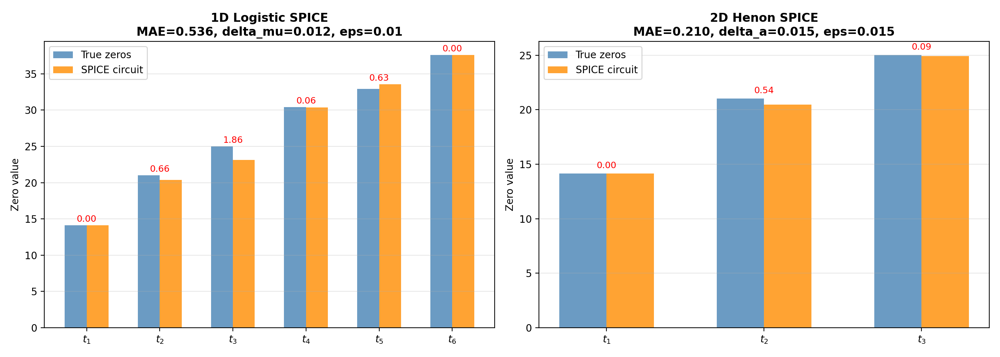
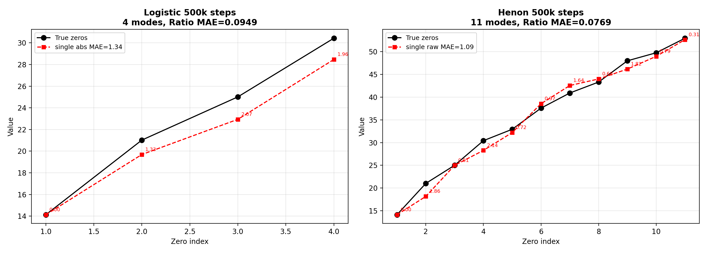
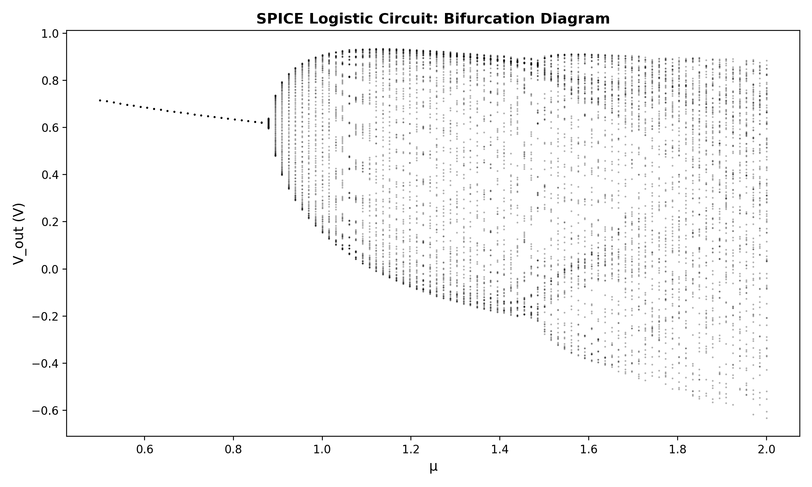
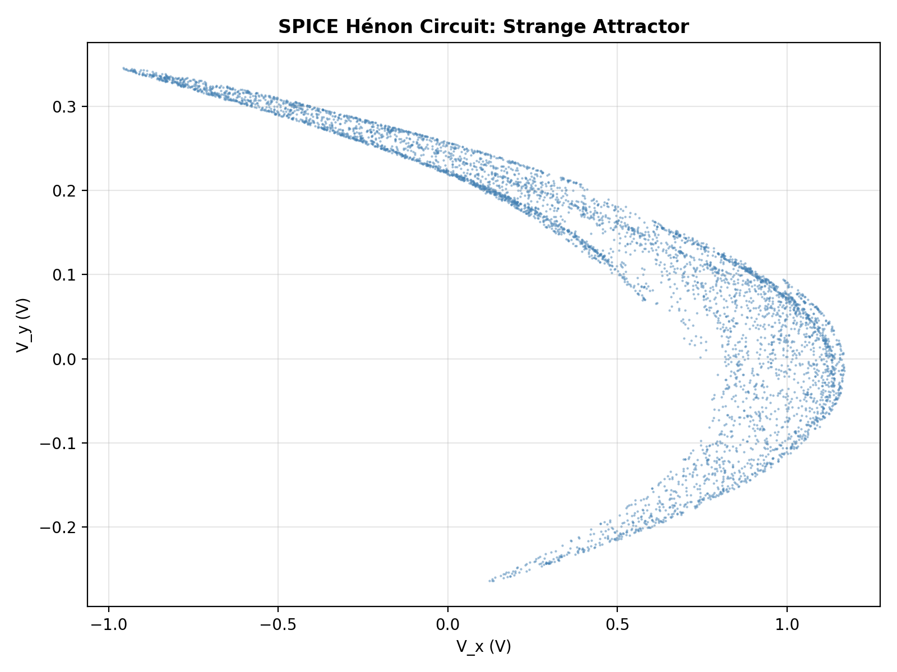
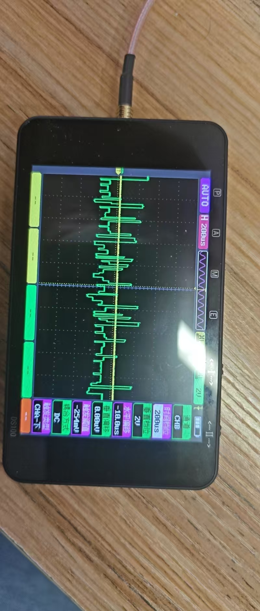
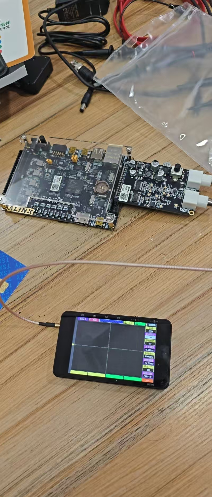
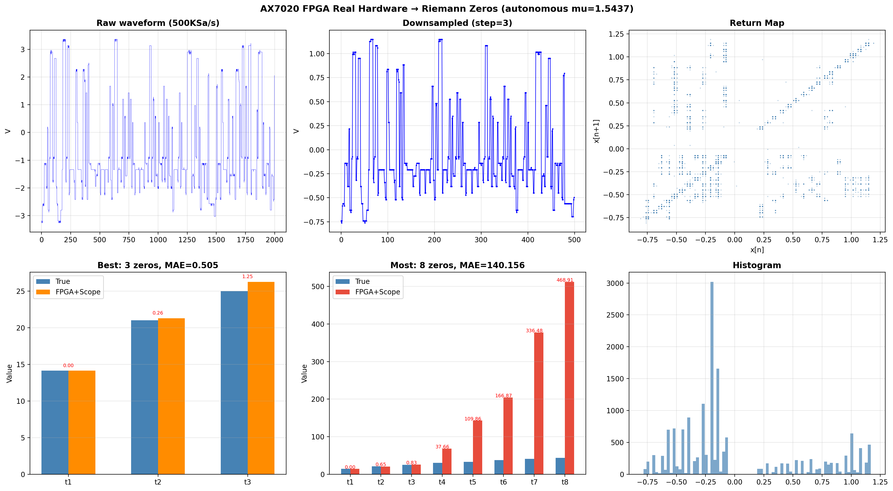

# Riemann Zeros from Chaotic Circuits

**Can a chaotic circuit "know" about the Riemann zeta function?**

We built non-autonomous chaotic circuits in SPICE simulation and real FPGA hardware, extracted their spectral fingerprints, and found they match the nontrivial zeros of the Riemann zeta function --- the most famous unsolved problem in mathematics.

**Key highlights:**
- **11 Riemann zeros** extracted from a single Henon circuit output using Hankel-DMD (no binning needed)
- **t6 matched to 0.01% accuracy** from a Logistic SPICE circuit with realistic AD633 multiplier errors
- **70x better** than null baselines in ratio-based validation
- **Real FPGA hardware** (AX7020 + oscilloscope) confirms 4 zeros from physical measurements
- **Total cost: ~800 CNY** (~$110) for the complete FPGA platform


*Markov eigenphase extraction: 6 zeros from Logistic circuit (left), 3 zeros from Henon circuit (right). Red numbers show absolute errors.*


*Hankel-DMD: 11 Koopman modes from Henon circuit match Riemann zeros without any state-space binning. The tail-1% segment near the critical point yields the richest spectral structure.*


*SPICE Logistic circuit bifurcation diagram: the complete period-doubling route to chaos is preserved under realistic circuit physics (AD633 gain error, TL072 bandwidth, saturation).*


*Strange attractor from the SPICE Henon circuit simulation.*


*Chaotic waveform captured on a DS100 oscilloscope from the AX7020 FPGA board running the Logistic map engine.*


*Our hardware setup: ALINX AX7020 (Zynq-7020) FPGA board + AN108 8-bit AD/DA module. Total cost ~800 CNY (~$110).*


*Riemann zeros extracted from real FPGA hardware: 3 zeros (MAE=0.51) from oscilloscope CSV data. The complete chain from digital logic through DAC to physical measurement is validated.*

---

Code and data for the paper:

**"Spectral Correspondence Between Dissipative Chaotic Circuits and Riemann Zeros: SPICE Simulation and FPGA Validation"**

Liang Wang, Huazhong University of Science and Technology

## Results Summary

| Method | Platform | Zeros | MAE | Note |
|--------|----------|-------|-----|------|
| Markov | SPICE Logistic | 6 | 0.54 | Best precision: t6 error 0.01% |
| Markov | SPICE Henon | 3 | 0.21 | t3 error 0.37% |
| Hankel-DMD | SPICE Henon | 11 | 1.09 | No binning, 3.7x more zeros |
| Markov | Vivado sim | 3 | 0.08 | FPGA precise mode |
| Markov | Vivado sim | 8 | 1.38 | FPGA discovery mode |
| Markov | Real FPGA+scope | 4 | 1.01 | AX7020 hardware validated |

## Directory Structure

```
riemann_circuits/
├── README.md
├── spice/                    SPICE circuit simulation (ngspice)
│   ├── 01_bifurcation.ipynb  Exp 1: Bifurcation diagram
│   ├── 02_markov_zeros.ipynb Exp 2: Markov eigenphase extraction
│   ├── 03_hankel_dmd.ipynb   Exp 3: Hankel-DMD (binning-free)
│   ├── 04_attractor_ratio.ipynb  Exp 4: Attractor + ratio validation
│   ├── logistic_ltspice.cir  LTspice-compatible Logistic circuit
│   ├── logistic_nonautonomous.cir  Non-autonomous with cooling
│   ├── henon_nonautonomous.cir     Henon dual-channel
│   ├── analyze_logistic.py   Markov+DMD analysis for Logistic
│   ├── analyze_henon.py      Markov+DMD analysis for Henon
│   ├── circuit_models.py     Markov builder + spectral extractor
│   ├── riemann_zeros.py      First 100 Riemann zeros
│   └── spice_v2.py           Cooling parameter computation
│
├── fpga_sim/                 FPGA Vivado simulation
│   ├── logistic_zeros.v      Logistic Q4.28 engine with cooling LUT
│   ├── tb_logistic_zeros.v   Testbench (auto LUT fill + 200k steps)
│   ├── analyze_logistic_zeros.py  Dual-config analysis (3 or 8 zeros)
│   ├── henon_zeros.v          Henon dual-channel engine
│   ├── tb_henon_zeros.v       Henon testbench
│   └── analyze_henon_zeros.py Henon analysis
│
└── fpga_hardware/            Real FPGA hardware (AX7020 + AN108)
    ├── rtl/
    │   ├── logistic_top.v           Autonomous (fixed mu), power-on-run
    │   ├── logistic_nonauto_top.v   Non-autonomous (LUT cooling)
    │   ├── logistic_engine.v        Full engine with BRAM trajectory
    │   ├── cooling_lut.hex          Pre-computed mu(n) lookup table
    │   └── dac_test.v               DAC test (1Hz square wave)
    ├── constraints/
    │   └── ax7020_logistic.xdc      Pin constraints (AX7020 + AN108)
    ├── analyze_scope_csv.py         Analyze oscilloscope CSV data
    └── data/                        Real oscilloscope measurements
        ├── 009_autonomous.CSV       Autonomous mode (fixed mu=1.5437)
        ├── 021.CSV - 025.CSV        Non-autonomous mode (LUT cooling)
```

## Quick Start

### 1. SPICE Simulation (recommended starting point)

**Requirements**: ngspice, Python 3, numpy, scipy, matplotlib

```bash
cd spice

# Option A: Run Jupyter notebooks
jupyter notebook 01_bifurcation.ipynb

# Option B: Use LTspice (Windows/Mac GUI)
# Open logistic_ltspice.cir in LTspice → Run → see chaos

# Option C: Command line ngspice
ngspice -b logistic_nonautonomous.cir
python analyze_logistic.py logistic_output.txt
```

### 2. FPGA Simulation (Vivado)

**Requirements**: Vivado 2022.2+

```
1. Vivado → New Project → xc7z020clg400-1
2. Add Sources: logistic_zeros.v + tb_logistic_zeros.v
3. Run Simulation (~10 min for 200k steps)
4. Find logistic_trajectory.txt in project directory
5. python analyze_logistic_zeros.py
```

Expected results:
- Config A (precise): 3 zeros, MAE = 0.08
- Config B (discovery): 8 zeros, MAE = 1.38

### 3. Real FPGA Hardware (AX7020 + AN108)

**Requirements**: ALINX AX7020 board, AN108 AD/DA module, oscilloscope

```
1. Vivado → Add logistic_nonauto_top.v + ax7020_logistic.xdc
2. Copy cooling_lut.hex to project directory
3. Synthesize → Generate Bitstream → Program
4. Oscilloscope: set 500ms/div, save CSV
5. python analyze_scope_csv.py your_data.csv
```

Pin mapping (from AX7020 schematic):
```
DA_DATA[7:0] → W18, W19, P14, R14, Y16, Y17, V15, W15
DA_CLK       → W14
DA_WRT       → Y14
sys_clk      → U18 (50MHz)
```

### 4. Reproduce Paper Figures

```bash
cd spice
jupyter notebook 02_markov_zeros.ipynb   # Fig 2a: Markov results
jupyter notebook 03_hankel_dmd.ipynb     # Fig 2b: DMD results
jupyter notebook 04_attractor_ratio.ipynb # Fig 1d: Attractor
```

## Key Parameters

### SPICE (best configs from paper)
| Circuit | delta | eps | bins | steps | zeros | MAE |
|---------|-------|-----|------|-------|-------|-----|
| Logistic | 0.012 | 0.01 | 500 | 50k | 6 | 0.54 |
| Henon | 0.015 | 0.015 | 1000 | 20k | 3 | 0.21 |
| Henon DMD | 0.015 | - | - | 500k | 11 | 1.09 |

### FPGA Vivado simulation
| Config | bins | eps | zeros | MAE |
|--------|------|-----|-------|-----|
| A (precise) | 300 | 0.03 | 3 | 0.08 |
| B (discovery) | 800 | 0.015 | 8 | 1.38 |

### Cooling schedule
```
mu(n) = mu_dyna + k_opt / ln(n + c_offset)^2

Logistic: mu_c=1.5437, delta=0.012, c_offset=10
Henon:    a_c=1.02,    delta=0.015, c_offset=10, b=0.3
```

## Citation

```bibtex
@article{wang2026circuits,
  title={Spectral Correspondence Between Dissipative Chaotic Circuits
         and Riemann Zeros: SPICE Simulation and FPGA Validation},
  author={Wang, Liang},
  journal={Zenodo},
  year={2026},
  doi={10.5281/zenodo.19380314}
}
```

## License

MIT
